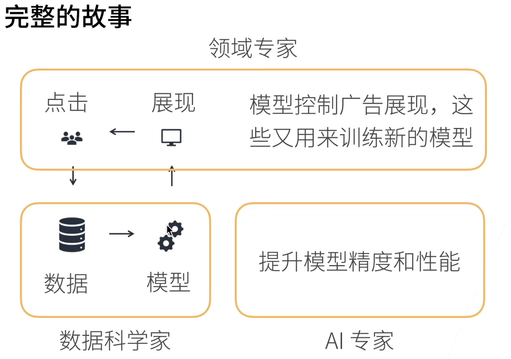

bilibili

## 0.准备
### 0.1 内容概要 
- 深度学习基础 -- 线性神经网络，多层感知机
- 卷积神经网络 -- LeNet,AlexNet,VGG,Inception,ResNet
- 循环神经网络 -- RNN,GRU,LSTM,seq2seq
- 注意力机制 -- Attention,Transformer
- 优化算法 -- SGD,Momentum,Adam
- 高性能计算 -- 并行，多GPU，分布式
- 计算机视觉 -- 目标检测，语义分割
- 自然语言处理 -- 词嵌入，BERT

1. 深度学习的应用场景
    1. 图片分类
    2. 物体检测和分割
    3. 样式迁移（如加滤镜）
    4. 人脸合成
    5. 文字生成图片
    6. 文字生成
    7. 无人驾驶
    8. 广告点击

### 0.2 环境
> miniconda
> 
> python3.8
> 
> python install d2l torch torchvision
> 

### 0.3 数据操作
1. 数据类型
   - 0维 就是一个标量，一个数字
   - 1维 一个样本的特征，抽象为一个向量
   - 2维 样本 -- 特征
   - 3维 RGB图片（宽 x 高 x rgb通道）
   - 4维 一组RGB图片批量（批量大小 x 宽 x 高 x rgb通道）
   - 5维 一个视频批量(批量大小 x 时间 x 宽 x 高 x rgb通道)